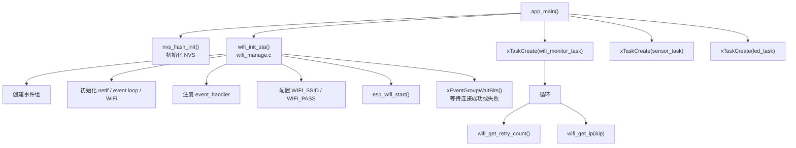

# ESP32-S3 IoT Terminal

## 🔧 硬件环境

- 主控：ESP32-S3 开发板
- 开发环境：VSCode + ESP-IDF v5.5.5
- 连接方式：2.4GHz WiFi（手机热点/路由器）

## 📈 当前进度

- [x] 复制 `wifi/getting_started/station` 示例并成功编译烧录
- [x] 成功连接 WiFi，获取 IP：`192.168.xxx.xx`
- [x] 验证断线重连：路由器断电恢复，观察到 `WIFI_EVENT_STA_DISCONNECTED` 和自动重连过程

## 📝 今日笔记

1. **事件循环干嘛**：esp_event_loop_create_default() 起一个后台任务，把 WiFi/IP 驱动抛出的事件排队，再按注册关系逐个调用 event_handler，让连接过程变成“来事件再处理”，而不是在 wifi_init_sta 里死等
2. **回调为什么不能做重活**：event_handler 跑在这条事件循环任务里，卡住它，后面的 WIFI_EVENT / IP_EVENT 就发不出去，所以这里只该做 esp_wifi_connect()、改计数、置 event group 这种轻操作。
3. **重连在哪触发**：断开时驱动发 WIFI_EVENT_STA_DISCONNECTED，进 event_handler 后若 s_retry_num 还没到上限，就再调一次 esp_wifi_connect()，重连就是在这里触发的。

# ESP32 WiFi 初始项目说明

## 一、启动流程

`app_main()` 是程序入口，主要完成 NVS 初始化、WiFi 初始化，并创建三个 FreeRTOS 任务。

```text
app_main()
  │
  ├─ nvs_flash_init()                 // 初始化 NVS
  │
  ├─ wifi_init_sta()                  // 调用 wifi_manage.c 里的函数
  │    ├─ 创建事件组
  │    ├─ 初始化 netif / event loop / WiFi
  │    ├─ 注册 event_handler
  │    ├─ 配置 WIFI_SSID / WIFI_PASS
  │    ├─ esp_wifi_start()
  │    └─ xEventGroupWaitBits()        // 等待连接成功或失败
  │
  ├─ xTaskCreate(wifi_monitor_task)
  │    └─ 循环：
  │         ├─ wifi_get_retry_count()  // 来自 wifi_manage.c
  │         └─ wifi_get_ip(&ip)        // 来自 wifi_manage.c
  │
  ├─ xTaskCreate(sensor_task)
  │
  └─ xTaskCreate(led_task)
```

## 二、流程示意图



## 三、任务与函数说明

| 任务 / 函数 | 所属模块 | 说明 |
|---|---|---|
| `nvs_flash_init()` | 系统 | 初始化 NVS 非易失存储 |
| `wifi_init_sta()` | `wifi_manage.c` | 初始化 WiFi STA 模式，并等待连接结果 |
| `wifi_monitor_task` | 应用任务 | 循环获取 WiFi 重试次数和 IP |
| `sensor_task` | 应用任务 | 传感器采集或处理任务 |
| `led_task` | 应用任务 | LED 状态指示任务 |

## 四、WiFi 初始化流程

1. 创建事件组
2. 初始化 `netif`、event loop、WiFi
3. 注册 `event_handler`
4. 配置 `WIFI_SSID` / `WIFI_PASS`
5. 调用 `esp_wifi_start()`
6. 使用 `xEventGroupWaitBits()` 等待连接成功或失败

## 五、备注

- `wifi_get_retry_count()` 和 `wifi_get_ip()` 来自 `wifi_manage.c`
- 任务创建顺序为：
  1. `wifi_monitor_task`
  2. `sensor_task`
  3. `led_task`

